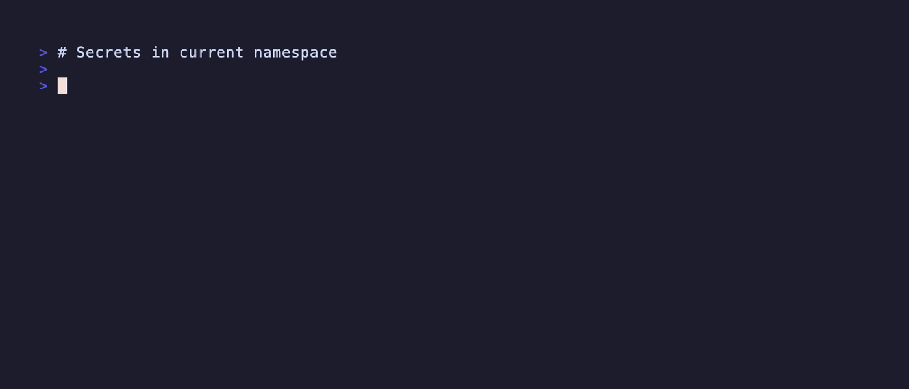

# kubectl-view-secret

[](https://goreportcard.com/report/github.com/elsesiy/kubectl-view-secret)

[](https://codecov.io/github/elsesiy/kubectl-view-secret)
[](http://twitter.com/elsesiy)
[](https://github.com/elsesiy/kubectl-view-secret/releases)



This plugin allows for easy secret decoding. Useful if you want to see what's inside of a secret without always go through the following:

1. `kubectl get secret <secret> -o yaml`
2. Copy base64 encoded secret
3. `echo "b64string" | base64 -d`

Instead you can now do:

    # print secret keys
    kubectl view-secret <secret>
    
    # decode specific entry
    kubectl view-secret <secret> <key>
    
    # decode all contents
    kubectl view-secret <secret> -a/--all
    
    # print keys for secret in different namespace
    kubectl view-secret <secret> -n/--namespace <ns>

    # print keys for secret in different context
    kubectl view-secret <secret> -c/--context <ctx>

    # print keys for secret by providing kubeconfig
    kubectl view-secret <secret> -k/--kubeconfig <cfg>

    # suppress info output
    kubectl view-secret <secret> -q/--quiet

    # output in JSON format
    kubectl view-secret <secret> -o json

    # output in YAML format
    kubectl view-secret <secret> -o yaml

## Bash Completion

This plugin supports bash completion for kubectl versions 1.26 and later. To enable completion:

### Step 1: Enable kubectl completion

Follow the [Kubernetes docs](https://kubernetes.io/docs/tasks/tools/install-kubectl-macos/#optional-kubectl-configurations-and-plugins) to install shell completion.

### Step 2: Create the plugin completion script
```bash
# Place the following completion script somewhere in your $PATH, e.g. /usr/local/bin in this context
cat << "EOF" | sudo tee /usr/local/bin/kubectl_complete-view_secret > /dev/null
#!/bin/bash
kubectl view-secret __complete "$@"
EOF

# Make it executable
sudo chmod +x /usr/local/bin/kubectl_complete-view_secret
```

Then restart your shell or run:
```bash
source ~/.bashrc
```

### Step 3: Verify setup
```bash
# Check bash-completion is loaded
type _get_comp_words_by_ref

# Check kubectl completion is loaded
type _kubectl

# Test completion
kubectl view-secret <TAB>
```

Now you can use Tab completion for:
- Secret names: `kubectl view-secret <TAB>`
- Secret keys: `kubectl view-secret <secret> <TAB>`
- Namespaces: `kubectl view-secret <secret> -n <TAB>`

## Features

### Output Formats
- **Text**: Default human-readable format
- **JSON**: Structured output for automation and scripting
- **YAML**: Alternative structured format

### Secret Type Support
Supports decoding various Kubernetes secret types:
- **Opaque**: Standard base64 encoded secrets
- **Helm**: Double base64 encoded + gzip compressed Helm release data
- **TLS**: PEM encoded certificates and private keys
- **Docker Config**: JSON configuration for Docker registries
- **SSH Auth**: SSH private keys
- **Basic Auth**: Username/password credentials
- **Service Account Tokens**: JWT tokens

### Interactive Mode
- **Secret Selection**: When no secret is specified, provides an interactive list to choose from
- **Key Selection**: When multiple keys exist, allows selecting specific keys or viewing all

## Usage

### Krew

This plugin is available through [krew](https://krew.dev) via:

```sh
kubectl krew install view-secret
```

### Binary releases

#### GitHub
You can find the latest binaries in the [releases](https://github.com/elsesiy/kubectl-view-secret/releases) section.  
To install it, place it somewhere in your `$PATH` for `kubectl` to pick it up.

**Note**: If you build from source or download the binary, you'll have to change the name of the binary to `kubectl-view_secret` (`-` to `_` in `view-secret`)
due to the enforced naming convention for plugins by `kubectl`. More on this [here](https://kubernetes.io/docs/tasks/extend-kubectl/kubectl-plugins/#naming-a-plugin).

#### AUR package
Thanks to external contributions the plugin is available in the Arch user repository.
| Package | Contributor |
| -- | -- |
| [bin](https://aur.archlinux.org/packages/kubectl-view-secret-bin) | [@jocelynthode](https://github.com/jocelynthode) |
| [git](https://aur.archlinux.org/packages/kubectl-view-secret-git) | [@aryklein](https://github.com/aryklein) |

#### Nix
You can install the latest version from Nixpkgs ([25.05](https://search.nixos.org/packages?channel=25.05&show=kubectl-view-secret&from=0&size=50&sort=relevance&type=packages&query=kubectl-view-secret), [unstable](https://search.nixos.org/packages?channel=unstable&show=kubectl-view-secret&from=0&size=50&sort=relevance&type=packages&query=kubectl-view-secret)) or try it via a temporary nix-shell:

```
nix-shell -p kubectl-view-secret
```

### Build from source

    # Clone this repository (or your fork)
    git clone https://github.com/elsesiy/kubectl-view-secret
    cd kubectl-view-secret
    make

## License

This repository is available under the [MIT license](https://choosealicense.com/licenses/mit/).
